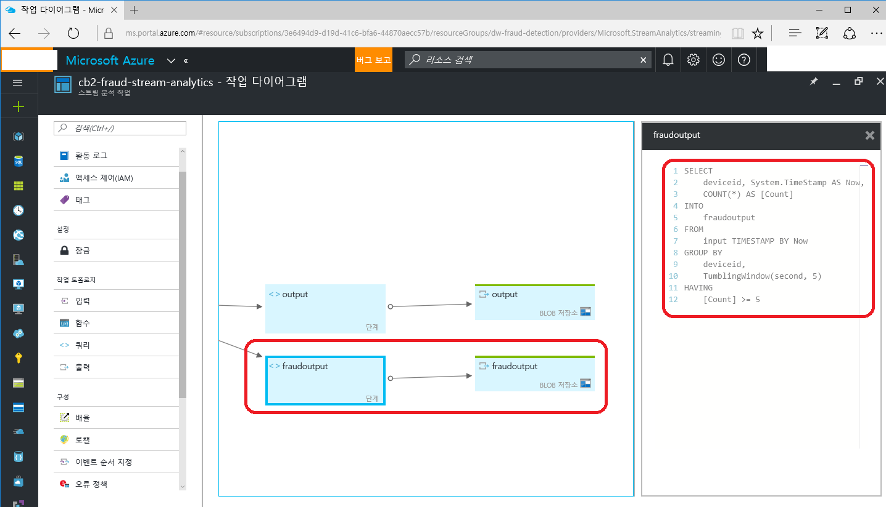

# kr-iot-sec
2016년 11월 4일 KISA IoT Hackathon 멘토링을 위한 Repository  
Short URL : http://aka.ms/kr-iot-sec  
Fraud detection device code : 하위 vscode 참조  

###Stream analytics real-time analytics API
Stream Analytics에서 Fraud Detection이 가능하도록 구성  

**Fraud Detection 분석을 위한 Stream analytics 목표 :**  

Stream Analytics에서 실시간으로 purchase API에 5초에 5회 이상 접속하는 어뷰징 사용자를 실시간으로 검출 수행  

- 일반적으로 요청하는 Normal-Device를 simulate하는 어플리케이션 수행

- 5초에 30여회 이상 요청하는 Fraud-Device를 simulate 하는 어플리케이션 수행

- Stream 분석은 SQL 쿼리와 유사한 패턴으로 처리되며, 다양한 Abusing을 검출 가능


```

while (i <= 50)

{

    int level = rand.Next(0, 100);

    int points = rand.Next(0, 50);

    int winnerYN = 0;


    var telemetryDataPoint = new

    {

        deviceId = "cb2-fraud-device",

        DateTime.Now,

        level,

        points,

        winnerYN

        //prediction

    };

    var messageString = JsonConvert.SerializeObject(telemetryDataPoint);

    var message = new Message(Encoding.ASCII.GetBytes(messageString));


    await deviceClient.SendEventAsync(message);

    Console.WriteLine("{0} > Sending message: {1}", DateTime.Now, messageString);


    Task.Delay(1).Wait();	// delay 없이 바로 다음 loop 수행해 fraud device 시뮬레이션

    i++;

}

```

IoTHub 쪽으로 두개의 디바이스가 데이터를 push 하는 시뮬레이션 수행  


Stream Anlytics에서 input을 통해 stream data를 가져와 처리  

아래의 Stream 쿼리는 5초 이내에 5회 이상 요청이 들어온 경우 abusing으로 판단해, 이 데이터를 fraudoutput blob 저장소로 출력 수행.  





```

SELECT

    *

INTO

    output

FROM

    input TIMESTAMP BY Now

SELECT

    deviceid, System.TimeStamp AS Now,

    COUNT(*) AS [Count]

INTO

    fraudoutput

FROM

    input TIMESTAMP BY Now

GROUP BY

    deviceid, 

    TumblingWindow(second, 5)

HAVING

    [Count] >= 5

```


Stream Analytics를 실행하고, fraud device를 수행한 후, fraudoutput을 확인  


###Real-time Business Intelligence 플랫폼

데이터를 visualize 시키기 위한 Business Intelligence 플랫폼 제공  


마찬가지로, Business Intelligence를 위한 시각화 역시, 개별 property가 워낙에 다르기 때문에 기본적인 빌딩 블록을 제시하고 게임서버 개발자가 이를 원하는 시각화로 배포 하는 것을 목표로 수행  


이를 위해 Power BI를 이용해 시각화 모델을 만들고, 이를 웹에서 분석하거나 관리자 페이지에서 iframe 등으로 embed해 데이터 분석을 목표로 개발함.


- Power BI Desktop을 이용한 시각화 디자인 수행


-   

간단히 Hadoop에서 Hive로 생선한 결과를 로드하고, 시각화 과정을 통해 Bar-chart로 구현


- Power BI를 Power BI 서비스로 배포


-   

Power BI에 게시된 상태이기 때문에 팀에서 손쉬운 Report 를 공유하고 협업 가능


- 생성한 Report를 CloudBread의 Admin-Web 등으로 게시하기 위해 embed 코드 생성


-   

일반 웹페이지에 게시하는 과정을 수행하며, Link 방식과 Embed 방식 모두 제공  


- 생성된 리포트 데이터를 Admin-Web 또는 팀사이트 등에 게시


-   

웹 페이지 등에 Interactive Report로 첨부가 가능  


### node.js에서 Azure Blob 저장소에 접근 하는 예제 코드
node.js-storage-code 폴더의 코드 참조  

### Azure Blob Storage에 instant로 접근하기 위한 token 생성
Stored Access Policy 내용 참조  
컨테이너 및 Blob에 대한 익명 읽기 권한 관리 : https://azure.microsoft.com/ko-kr/documentation/articles/storage-manage-access-to-resources/  

감사합니다.
